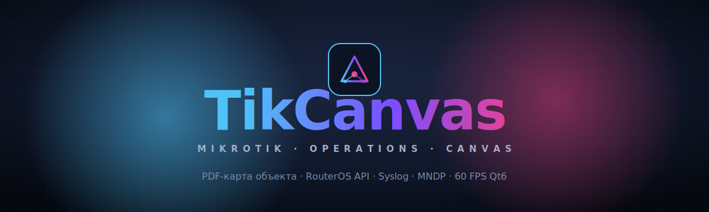

<div align="center">



<br/>

[](#-quick-start)
[](#-архитектура)
[](#-сборка-из-исходного-кода)
[](#-дорожная-карта)

<br/>


<br/>

### **Один экран. Карта объекта. Все ваши роутеры.**
### _Реальное время. Без браузера. Без Electron. Чистый C++._

</div>

---

**TikCanvas** — нативное Qt6/C++20 приложение для сетевых инженеров, которое объединяет визуальную карту инфраструктуры (PDF-чертежи здания, объекта, площадки) с инструментами оперативного управления MikroTik-устройствами.

Каждый сетевой компонент работает в собственном `QThread` через паттерн **Worker + moveToThread**, рендер PDF выполняется в `QtConcurrent` — UI остаётся отзывчивым на 60 FPS даже при сотнях устройств в Syslog-потоке.

---

## 📋 Содержание

- [✨ Возможности](#-возможности)
- [🏗 Архитектура](#-архитектура)
- [🧩 Стек](#-стек)
- [⚡ Quick Start](#-quick-start)
- [📦 Установка зависимостей](#-установка-зависимостей)
- [🔧 Сборка из исходного кода](#-сборка-из-исходного-кода)
- [🖥 Использование](#-использование)
- [🗂 Структура проекта](#-структура-проекта)
- [🗺 Дорожная карта](#-дорожная-карта)
- [📜 License](#-license)
- [👤 Автор](#-автор)

---

## ✨ Возможности

<table>
<tr>
<td width="50%" valign="top">

### 🗺 PDF Map Canvas
Высококачественная отрисовка чертежей через **Poppler-Qt6**.
Плавный pan & zoom, рендер в фоновом потоке через `QtConcurrent` — UI никогда не залипает на больших файлах.

</td>
<td width="50%" valign="top">

### 📡 RouterOS API клиент
Собственная реализация поверх `QTcpSocket` — **без внешних зависимостей**.
Поддержка `/login`, отправка любых API-команд (`/system/reboot`, `/interface/print`, …).

</td>
</tr>
<tr>
<td width="50%" valign="top">

### 📥 Syslog Server
UDP-коллектор на порту **514** в выделенном `QThread`.
Лайв-вывод сообщений от роутеров с фильтрацией по host.

</td>
<td width="50%" valign="top">

### 🛰 MNDP Auto-discovery
Broadcast-сканер протокола **MikroTik Neighbor Discovery** на порту 5678.
Автоматически собирает MAC, IP и identity всех устройств в LAN.

</td>
</tr>
<tr>
<td width="50%" valign="top">

### 🎨 Современный тёмный UI
Все формы в `.ui` (Qt Designer), темизация через **QSS**.
Лёгкая кастомизация без перекомпиляции.

</td>
<td width="50%" valign="top">

### ⚡ Асинхронность везде
Сеть и PDF — вне главного потока.
Гарантированные **60 FPS** в любой нагрузке.

</td>
</tr>
</table>

---

## 🏗 Архитектура

```
┌──────────────────────────────────────────────────────────────────┐
│                        MAIN UI THREAD                            │
│  ┌──────────────────────────────────────────────────────────┐    │
│  │  MainWindow  ←─ MainWindow.ui (Qt Designer) + dark.qss   │    │
│  │      │                                                   │    │
│  │      ├── MapCanvas      (QWidget, paint PDF + overlays)  │    │
│  │      ├── DeviceList     (QListWidget)                    │    │
│  │      └── SyslogView     (QPlainTextEdit)                 │    │
│  └──────────────────────────────────────────────────────────┘    │
│           ▲ signals                                              │
└───────────┼──────────────────────────────────────────────────────┘
            │
   ┌────────┴─────────┬──────────────┬──────────────┐
   │                  │              │              │
┌──┴────────┐  ┌──────┴─────┐  ┌─────┴─────┐  ┌─────┴─────┐
│ MikroTik  │  │  Syslog    │  │   MNDP    │  │ PdfRender │
│ Manager   │  │  Server    │  │  Scanner  │  │ (Concurr.)│
│           │  │            │  │           │  │           │
│  QThread  │  │  QThread   │  │  QThread  │  │ QtConcur. │
│ QTcpSocket│  │ QUdpSocket │  │ QUdpSocket│  │  Poppler  │
│   :8728   │  │    :514    │  │   :5678   │  │           │
└───────────┘  └────────────┘  └───────────┘  └───────────┘
```

> 💡 Каждый сетевой компонент изолирован в своём потоке через паттерн **Worker + moveToThread**. Связь — через сигналы Qt с автоматической диспетчеризацией.

---

## 🧩 Стек

| Слой              | Технология                        | Зачем                                    |
|-------------------|-----------------------------------|------------------------------------------|
| 🧠 Язык           | **C++20**                          | concepts, ranges, designated init        |
| 🖼 UI Framework   | **Qt 6.8** (Widgets)               | нативный кросс-платформенный UI          |
| ⚙️ Build          | **CMake 3.21+** + Ninja            | кросс-платформенная сборка               |
| 📄 PDF            | **Poppler-Qt6**                    | high-DPI рендеринг чертежей              |
| 🌐 Networking     | **QTcpSocket** / **QUdpSocket**    | без внешних сетевых библиотек            |
| 🧵 Concurrency    | **QThread** + **QtConcurrent**     | строго асинхронная архитектура           |
| 🎨 Theming        | **QSS** (Qt Style Sheets)          | кастомизация без перекомпиляции          |

---

## ⚡ Quick Start

```bash
git clone https://github.com/DuminAndrew/TikCanvas.git
cd TikCanvas

cmake -S . -B build -DCMAKE_BUILD_TYPE=Release
cmake --build build --parallel

./build/src/TikCanvas        # Linux / macOS
.\build\src\TikCanvas.exe    # Windows
```

> ⚠️ Для рендеринга PDF нужен **Poppler-Qt6**. Без него проект соберётся, но карта будет показывать заглушку.

---

## 📦 Установка зависимостей

<details open>
<summary><b>🪟 Windows (vcpkg)</b></summary>

```powershell
vcpkg install qtbase:x64-windows poppler[qt]:x64-windows
```

Либо через официальный установщик [Qt Online Installer](https://www.qt.io/download-qt-installer) — версия 6.5+ (msvc2022_64).

</details>

<details>
<summary><b>🐧 Linux (Debian / Ubuntu)</b></summary>

```bash
sudo apt install \
    cmake build-essential ninja-build \
    qt6-base-dev qt6-tools-dev \
    libpoppler-qt6-dev pkg-config
```

</details>

<details>
<summary><b>🍎 macOS (Homebrew)</b></summary>

```bash
brew install cmake ninja qt poppler pkg-config
```

</details>

---

## 🔧 Сборка из исходного кода

### 1. Подготовка окружения
- Компилятор с поддержкой **C++20** (MSVC 2022 / GCC 11+ / Clang 14+)
- **Qt 6.5+** (рекомендуется 6.8.x)
- **CMake 3.21+**
- **Poppler-Qt6** (опционально, но рекомендуется)

### 2. Клонирование и конфигурация
```bash
git clone https://github.com/DuminAndrew/TikCanvas.git
cd TikCanvas
cmake -S . -B build -G Ninja -DCMAKE_BUILD_TYPE=Release
```

### 3. Сборка
```bash
cmake --build build --parallel
```

### 4. Запуск
```bash
./build/src/TikCanvas
```

---

## 🖥 Использование

| Шаг | Действие                                                                |
|-----|-------------------------------------------------------------------------|
| 1   | Запустите `TikCanvas`                                                   |
| 2   | **Load PDF Map** → выберите чертёж объекта                              |
| 3   | **Discover (MNDP)** → broadcast в LAN, найденные устройства появятся в списке |
| 4   | Введите Host / User / Password → **Connect**                            |
| 5   | **Reboot** → отправит `/system/reboot` через RouterOS API               |
| 6   | Syslog в реальном времени отображается в нижней панели                  |

---

## 🗂 Структура проекта

```
TikCanvas/
├── 📄 CMakeLists.txt           ← root CMake (находит Qt6 + Poppler-Qt6)
├── 📄 README.md
├── 📄 LICENSE
├── 🎨 icon.svg                 ← иконка приложения
│
├── 📁 .github/
│   └── 🖼 banner.svg
│
├── 📁 src/
│   ├── 📄 CMakeLists.txt
│   ├── 🚀 main.cpp
│   ├── 🪟 MainWindow.{h,cpp,ui}
│   │
│   ├── 📁 widgets/
│   │   └── 🗺 MapCanvas.{h,cpp}    ← кастомный QWidget для PDF
│   │
│   └── 📁 core/
│       ├── 📡 MikroTikManager.{h,cpp}   ← RouterOS API (QTcpSocket)
│       ├── 📥 SyslogServer.{h,cpp}      ← UDP/514 collector
│       ├── 🛰 MndpScanner.{h,cpp}       ← MNDP discovery
│       └── 📄 PdfRenderer.{h,cpp}       ← Poppler-Qt6 wrapper
│
└── 📁 resources/
    ├── 📦 resources.qrc
    └── 🎨 dark.qss
```

---

## 🗺 Дорожная карта

- [x] MVP: MainWindow, темы, подключение MikroTik
- [x] Syslog Server + MNDP Scanner в QThread
- [x] PDF Canvas с Poppler-Qt6
- [ ] Drag-n-drop устройств на карту
- [ ] Рисование линков между устройствами
- [ ] Сохранение/загрузка проекта (`*.tikcanvas`)
- [ ] Встроенный SSH-терминал
- [ ] Backup-менеджер конфигов
- [ ] Светлая тема
- [ ] Мульти-язычность (i18n)

---

## 📜 License

Распространяется под лицензией **MIT**. Подробности — в файле [LICENSE](LICENSE).

---

## 👤 Автор

<div align="center">

### **Андрей Думин**

[](https://github.com/DuminAndrew)

</div>

---

## 🤝 Вклад в проект

Pull-request'ы приветствуются. Для крупных изменений сначала откройте issue.

```bash
git checkout -b feature/awesome
git commit -m "Add awesome feature"
git push origin feature/awesome
```

Затем откройте Pull Request.

<div align="center">

<br/>

**⭐ Если проект оказался полезен — поставьте звезду!**

</div>
